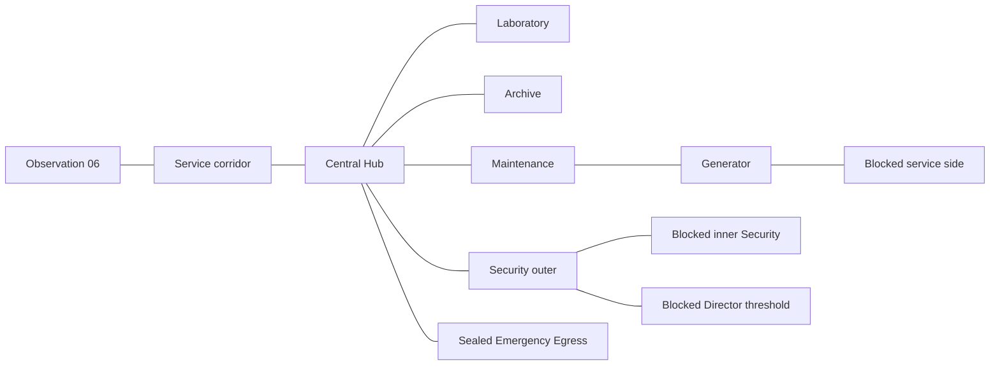

# Milestone 10A: facility graybox

F5 still starts Observation 06. Complete its existing puzzles, unlock/open the
exit, then walk through the service corridor into the Hub. No debug scene,
editor configuration, new Input Map action, or scene transition is required.

`scenes/levels/facility_graybox.tscn` is an editable static scene instanced under
the main room's Architecture/Facility node. It replaces only the old sealed
development corridor. It contains no gameplay scripts or Interactables.
Its equipment, signs, and status text are nonfunctional presentation. Milestone
10B replaces only the M-2 placeholder with a separate gameplay layer alongside
Architecture, plus two inspectable records; see [radio_elias.md](radio_elias.md).

## Area relationships

North is -Z; all floors remain at Y=0. The Hub is east of Observation 06.
The Laboratory is north of the Hub, Archive south, Maintenance northeast,
and Security southeast. The Generator is north of Maintenance. The prominent
Emergency Egress bulkhead and fixed status panel occupy the Hub's north wall.

| Area | Approximate clear footprint | Height | Access |
|---|---|---|---|
| Observation service corridor | 6 × 1.8 m | 2.8 m | Through the existing keyed exit |
| Central Hub | 10 × 10 m | 3.6 m | Open circulation and return routes |
| Laboratory | 7 × 7 m | 3.2 m | Open, through a 2 m link |
| Archive | 7 × 7 m | 3.2 m | Open, through a 2 m link |
| Maintenance | 7 × 7 m | 3.2 m | Open, through a 2 m link |
| Generator | 9 × 8 m | 3.8 m | Open via Maintenance and a 2 m link |
| Security outer | 6 × 5 m | 3.2 m | Open, through a 2 m link |
| Security inner | 5 × 5 m | 3.2 m | Visible through glazing; physically blocked |
| Director threshold shell | 6 × 5 m | 3.2 m | Sealed; office is not furnished/playable |
| Generator service side | 3 × 8 m | 3.8 m | Visible through steel grille; blocked |

Walls are approximately 0.2 m thick; portal headers leave 2.5 m clearance.
Links are approximately 2 m wide. At the existing 4 m/s movement speed,
sampled paths from just outside Observation to the Hub/wing interiors take
approximately 2–8.5 seconds before stops or exploration. Hub-to-wing travel
is shorter. No long transit tunnels are introduced.

## Composition and reserved equipment

- Hub: structural piers/beam, old control counter/CRT, bench, wall-mounted
  wing signs, double steel egress leaf, and static three-condition status panel.
- Laboratory: benches, a glazed bench partition, old analytical housing,
  sink cabinet, and reserved calibration/battery equipment locations.
- Archive: metal shelves, records boxes/cabinet, and a cassette workstation
  with an inert housing. Milestone 10B adds the Vale record at the personnel
  cabinet; the cassette workstation remains nonfunctional.
- Maintenance: workbench, tool storage, exposed services, and a radio work surface.
  Milestone 10B replaces its inert M-2 housing with the tunable radio from the
  separate investigation scene.
- Generator: machinery mass, pipework, control-console mounting area; markers
  reserve the pressure gauge, prime, field excitation, and breakers 1–4.
- Service side: inaccessible pipe/terminal placeholders reserve the future
  coolant bypass and M-4. The steel grille has full collision to its header.
- Security: heavy door/glazing boundary, outer access-terminal location,
  inner encoder bench and equipment rack. No card or power logic.
- Director: named sealed threshold on the administrative side. The office
  remains an empty reserved shell, without cabinet/terminal puzzle content.

Reserved locations are named Marker3D nodes visible in the editor only. They
are not floating labels, interactables, or implemented clues. Future puzzle
solutions live in GAME_DESIGN.md. Milestone 10B adds only the M-2 clue
records and folded note text; cassette descriptions and Mara dialogue remain
unchanged.

Concrete, green/gray lower walls, dark steel, wood surfaces, beige housings,
and restrained greenish fluorescent fixtures extend the existing visual
direction. Signs have physical backing plates and normal depth testing.
Emergency Egress reads OFF / INVALID / REQUIRED / EXIT SEALED regardless of
Observation auxiliary power; there is no macro-condition state manager.

## Validation and playtest concerns

`tests/facility_smoke.gd` checks floor-supported capsule connectivity, physical
body traversal/backtracking, compact route lengths, blocked regions, standing
and jumping barrier sweeps, sampled room shells, mounted signage, status text,
reserved markers, and absence of new scripts/interactables. It also checks
Observation's initial lock, inventory, power, and Mara state.

`tests/escape_smoke.gd` still runs the complete opening puzzle sequence and now
moves the real player body through the unlocked exit and corridor into the Hub.
All earlier smoke suites remain in use.

Run both scripts with `godot --headless --path . --script res://tests/NAME.gd`.
F5 is the integrated manual test: visit every open wing, return to the Hub,
try blocked thresholds, and confirm that the static egress status remains off.

The layout is deliberately compact and provisional. Headless checks do not
judge lighting, sign legibility, glass appearance, frame rate, or final visual
composition. Multiple shadowed local lights and primitive props need a visual
performance/playtest pass. Navigation tests sample movement paths and collision
boundaries; they are not exhaustive attempts at every jump or exploit.

The Milestone 10B radio investigation and Elias first contact are now implemented
outside this static shell. Main power, playback, card rewriting, authorization,
and final escape remain unimplemented.
